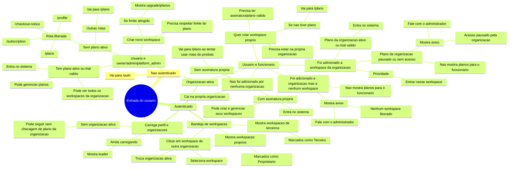
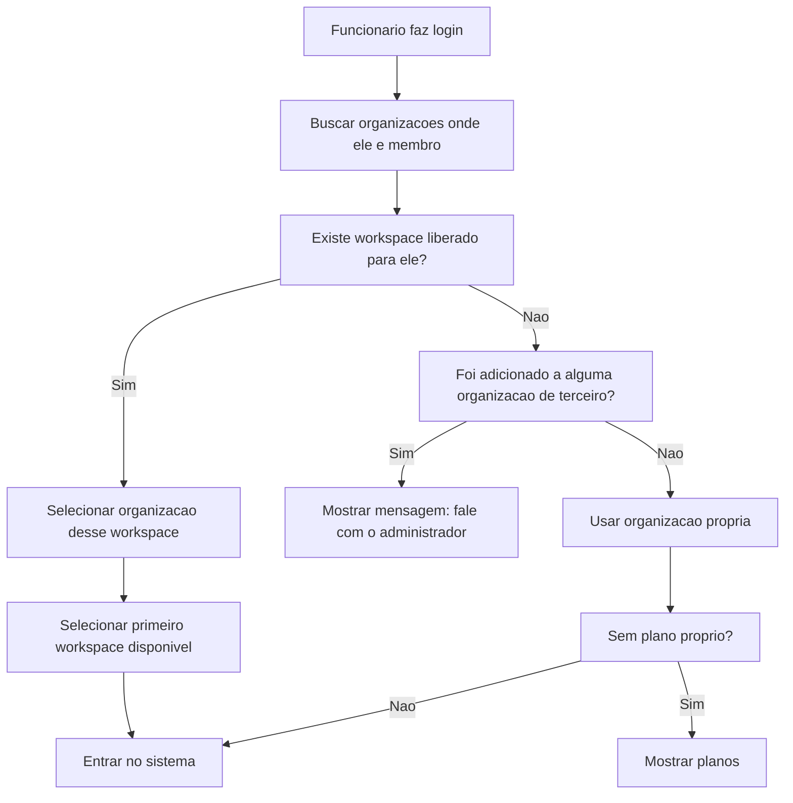

# Mapa mental: acesso, workspaces e planos

Este mapa resume quando o usuario entra direto, quando ve mensagem para falar com o administrador e quando aparece a tela de planos.

## Mapa mental em Mermaid

## Regras em linguagem direta

### 1. Quando aparece a tela de planos

A tela de planos deve aparecer quando:

- O usuario esta usando a propria organizacao.
- A organizacao ativa nao tem plano ativo nem trial valido.
- A rota atual nao e uma rota liberada sem plano.
- O usuario e owner/admin/platform_admin ou esta tentando criar/usar recursos proprios.

Rotas liberadas mesmo sem plano:

- `/plans`
- `/subscription`
- `/checkout-notice`
- `/profile`

### 2. Quando nao aparece a tela de planos

A tela de planos nao deve aparecer para funcionario que:

- Foi adicionado a uma organizacao de terceiro.
- Nao e owner/admin/platform_admin nessa organizacao.
- Esta apenas tentando acessar um workspace liberado pela organizacao.
- Ou foi adicionado a organizacao, mas ainda nao foi colocado em nenhum workspace.

Nesses casos, se houver problema, a responsabilidade e do administrador da organizacao, nao do funcionario.

### 3. Funcionario com workspace liberado

Fluxo esperado:

### 4. Funcionario sem workspace liberado

Mensagem esperada:

> Voce foi adicionada a essa organizacao, mas ainda nao esta em nenhum workspace. Faca contato com o administrador para liberar seu acesso.

Importante:

- Nao mandar para planos.
- Nao pedir assinatura do funcionario.
- Nao assustar a pessoa com cobranca.

### 5. Plano pausado, vencido ou ausente na organizacao do cliente

Se a pessoa e funcionaria de uma organizacao de terceiro e essa organizacao esta sem acesso:

- Mostrar aviso de acesso pausado.
- Orientar falar com o administrador.
- Nao abrir checkout para o funcionario.

Mensagem esperada:

> A organizacao precisa regularizar o plano para liberar o acesso. Fale com o administrador.

### 6. Usuario sem organizacao de terceiro

Se ninguem adicionou esse usuario a uma organizacao:

- Ele segue para a propria organizacao.
- Se nao tiver assinatura propria, aparece planos.
- Se tiver assinatura/trial valido, entra normalmente.
- Para criar workspaces proprios, precisa ter plano valido e limite disponivel.

### 7. Bandeja de workspaces

A bandeja deve misturar:

- Workspaces proprios.
- Workspaces de terceiros.

Cada workspace precisa deixar claro o tipo:

- `Proprietario`: workspace da organizacao que o usuario administra.
- `Terceiro`: workspace de uma organizacao onde o usuario foi convidado como funcionario.

Ao clicar em workspace de terceiro:

- A organizacao ativa muda para a organizacao daquele workspace.
- O workspace selecionado passa a ser o workspace clicado.
- As permissoes e plano passam a ser avaliados pela organizacao ativa.

## Tabela de decisoes

| Cenario | Tem plano proprio? | Foi adicionado a organizacao? | Tem workspace liberado? | O que acontece |
|---|---:|---:|---:|---|
| Usuario dono/admin sem plano | Nao | Nao importa | Nao importa | Vai para planos |
| Usuario dono/admin com trial valido | Sim/trial | Nao importa | Nao importa | Entra |
| Funcionario adicionado a workspace | Nao | Sim | Sim | Entra no workspace |
| Funcionario adicionado so na organizacao | Nao | Sim | Nao | Mensagem para falar com administrador |
| Funcionario de terceiro com plano da org pausado | Nao importa | Sim | Sim ou nao | Mensagem para falar com administrador |
| Usuario sem convite e sem assinatura | Nao | Nao | Nao | Vai para planos |
| Usuario sem convite e com assinatura | Sim | Nao | Pode criar | Entra e gerencia seus workspaces |

## Regra principal

Funcionario nao compra plano para acessar workspace de uma organizacao onde foi convidado.

Plano so deve aparecer para quem esta usando ou criando estrutura propria, ou para administradores responsaveis pela cobranca da organizacao ativa.
